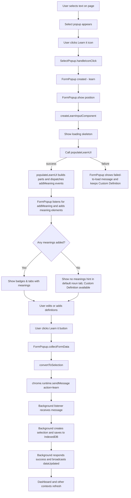

# Learn Flow (Click → Save)

This document visualizes the "Learn it" flow in the Select-Care extension. The diagram shows the UI components, service calls, background message, and storage steps from the moment the user clicks the Learn icon to when the selection is saved.

Notes:
- `populateLearnUI` calls an external dictionary adapter (`src/content_scripts/api/dictionary`) and dispatches `addMeaning` events.
- The popup keeps a "Custom Definition" button so the user can add definitions even if the dictionary yields no results.
- The save step uses `convertToSelection` (`src/content_scripts/data_mapper.ts`) and delivers the selection to the background via `chrome.runtime.sendMessage`.
- Background storage is handled in `src/service_worker/background.ts` and persists the selection to IndexedDB via `selectionDB`.

Accessibility & UX considerations:
- Loading skeleton uses a shimmer animation by default; the code respects `prefers-reduced-motion` for scrolling operations.
- When a meaning is expanded the popup will smooth-scroll the `.meanings-wrap` so the expanded element is fully visible (reduced motion respected).

Next steps (optional):
- Add an animated highlight when a new custom definition is created.
- Add a small toast on successful save.
- Add unit tests for the no-results and error flows.
